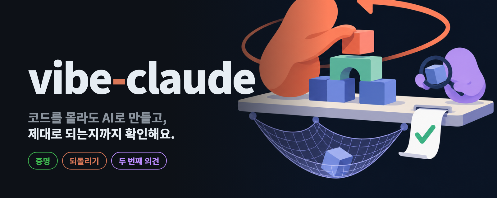

<p align="center">
  
</p>

<p align="center">
  <a href="README.md"><b>English</b></a> · <b>한국어</b>
</p>

<h2 align="center">Claude가 "다 했어요"라고 하면,<br>정말 되는지 vibe-claude가 확인해요.</h2>

<p align="center">
  코드는 읽지 않지만 Claude Code로 무언가를 만드는 사람을 위한 플러그인이에요.<br>
  한 번 설치하면 따로 배울 것은 없어요.
</p>

<table>
<tr>
<td width="50%" valign="top">

### 결과를 확인해요
코드를 실제로 실행해서 통과해야만 Claude가 작업을 끝낼 수 있어요. "잘 돼요"라는 말만으로는 끝나지 않아요.

</td>
<td width="50%" valign="top">

### 파일을 지켜요
모든 변경을 백업해요. 망가지거나 지워진 게 있으면 "되돌려줘"라고 하면 돼요.

</td>
</tr>
<tr>
<td width="50%" valign="top">

### 다른 AI가 한 번 더 봐요
OpenAI Codex를 쓰고 있다면 변경마다 검토하고, 진짜 문제가 있으면 Claude에게 다시 고치게 해요. Codex가 없으면 이 단계는 건너뛰어요.

</td>
<td width="50%" valign="top">

### 어려운 질문을 하지 않아요
위험한 작업은 사용자에게 묻지 않고 처리하고, 무슨 일이 있었는지 한 줄로 알려줘요.

</td>
</tr>
</table>

## 설치

Claude Code에 아래 두 줄을 붙여 넣으세요.

```text
/plugin marketplace add kks0488/vibe-claude
/plugin install vibe-claude@vibe-claude
```

Claude Code만 있으면 돼요. Codex는 없어도 괜찮아요.

<p align="center">
  
</p>

## 이렇게 보여요

작업이 끝날 때마다 실제로 무슨 일이 있었는지 한 줄로 알려줘요.

| 표시 | 뜻 |
| --- | --- |
| `vibe ✓ 파일 2개 변경 · 확인됨: npm test` | 마지막으로 고친 뒤에 실제로 시험했고, 통과했어요. |
| `vibe ⚠ … 확인 안 됨` | 시험해 볼 방법이 없었어요. 이 변경은 조심해서 보세요. |
| `vibe ✗ … 검사 실패` | 아직 고장 난 상태이고, Claude도 알고 있어요. |
| `되돌릴 수 없는 작업이 있었어요 — …` | 데이터베이스 초기화처럼 되돌릴 수 없는 일을 했어요. 무엇을 했는지 함께 적혀 있어요. |

되돌리고 싶으면 "되돌려줘" 또는 "로그인 고치기 전으로 돌려줘"라고 하면 돼요.

## 예시

Claude가 다 했다고 하다가 막히고, 테스트를 돌린 뒤 실제로 실행된 내용이 한 줄로 남아요.

<p align="center"></p>

지우기 전에 파일을 보관하고, 되돌릴 수 없는 작업 앞에서는 Claude가 한 번 멈춰 확인하고, "되돌려줘"로 파일을 되찾아요.

<p align="center"></p>

## 검증

- 16일 동안의 실제 작업 기록(명령 약 2만 2천 개)으로 다듬었어요.
- 자동 테스트 87개와 함께, 실제 Claude Code와 Codex로 직접 돌려 봤어요.
- 공개 전에 Codex에게 네 번 검토받았어요.
- AI 사용량은 1% 정도 늘어요.

---

<details>
<summary><b>기술 정보</b></summary>

<br>

| 기능 | 하는 일 |
| --- | --- |
| **증명** | 모든 명령과 실제 종료 코드를 기록해요. 코드를 바꾼 뒤에는 마지막 수정 이후 테스트·빌드·실행이 통과해야만 끝낼 수 있어요. 답변 속 말은 증거가 아니고, 파이프나 `;`, `\|\| true`로 결과를 가린 것도 인정하지 않아요. |
| **회귀 방지** | 이 프로젝트에서 예전에 통과했던 검사를 끝날 때 다시 돌려요. |
| **두 번째 의견** | [Codex CLI](https://github.com/openai/codex)가 설치·로그인돼 있으면, 변경 내용을 읽기 전용으로 뒤에서 검토하고(비밀키는 가림) 문제가 있으면 Claude를 다시 깨워요. |
| **요약 한 줄** | 모델이 아니라 기록을 보고 플러그인이 직접 만든 한 줄이에요. |
| **백업과 되돌리기** | 요청할 때마다, 위험한 명령 직전마다 프로젝트 밖(`~/.vibe-claude/`)의 별도 저장소에 파일을 저장해요. git을 안 쓰는 프로젝트도 돼요. `/vibe-claude:undo`로 되돌리고, 되돌린 것도 다시 되돌릴 수 있어요. |
| **휴지통** | 백업에 없는 파일(git 제외 파일, 5MB 넘는 파일, 프로젝트 밖 파일, 300MB까지)은 지우기 전에 7일 보관 휴지통에 복사해요. |
| **안전장치** | 되돌릴 수 없는 작업(데이터베이스 초기화, 강제 push, 클라우드 삭제, 브랜치 삭제)은 Claude를 한 번 멈춰 대화를 보고 판단하게 해요. 같은 명령을 다시 실행하면 진행되고, 영수증에 남아요. 프로젝트·홈 폴더·디스크 전체 삭제는 항상 거절해요. |
| **테스트 보호** | 검사를 지우거나 `skip`·항상 참인 검사를 넣는 수정, 커밋된 테스트 삭제는 한 번 멈추게 해요. |
| **패키지 확인** | 설치하려는 패키지가 공개 저장소에 없으면 막고, 생긴 지 14일 안 된 패키지는 한 번 더 확인하게 해요. 사내 저장소 이름은 밖으로 보내지 않아요. |
| **비밀키 확인** | 진짜처럼 보이는 API 키나 개인키를 코드에 쓰는 걸 막아요. `.env` 파일은 괜찮아요. |
| **문법 검사** | Python, JS, TS, JSON, YAML, TOML, 셸, 노트북을 수정할 때마다 검사해요. |

**필요한 것:** `python3`, `git`. Codex는 있으면 좋고 없어도 돼요.

**설정:** 프로젝트에 `.vibe/config.json`을 두면 바꿀 수 있어요(없어도 돼요).

```json
{ "codex": "auto", "ratchet": true, "snapshots": true, "packages": true, "lang": null, "safe_to_delete": [] }
```

`"codex": "off"`로 두 번째 의견을 끌 수 있어요. `lang`은 `"en"` 또는 `"ko"`이고, 기본값은 쓰는 언어를 따라가요.

**하지 않는 것:** Claude Code에 이미 있는 기능(계획 모드, 메모리, 서브에이전트, `/rewind`, `/code-review`, `/goal`)이나 다른 오픈소스(superpowers, spec-kit, claude-mem)가 잘하는 일은 다시 만들지 않아요. 모델이 꾸밀 수 없는 증명, 같은 모델이 아닌 검토자, 셸 명령까지 되돌리는 기능만 더해요. 플러그인 전체가 표준 라이브러리만 쓰는 파이썬 파일 하나([`hooks/vibe.py`](hooks/vibe.py))와 스킬 하나예요.

**자주 묻는 것.** *느려지나요?* 확인 안 된 변경은 테스트를 한 번 더 돌려요. 백업은 보통 1초도 안 걸려요. *Codex가 꼭 있어야 하나요?* 아니요. 없으면 검토 단계만 건너뛰어요. *Windows는요?* 아직 시험하지 않았어요. *예전의 에이전트 13개는요?* [docs/HISTORY.md](docs/HISTORY.md)에 정리돼 있어요.

</details>

<p align="center">
  <a href="https://github.com/kks0488/vibe-claude/actions/workflows/ci.yml"></a>
  <a href="https://github.com/kks0488/vibe-claude/releases"></a>
  <a href="LICENSE"></a>
  <br>
  <a href="CHANGELOG.md">변경 기록</a> · <a href="docs/HISTORY.md">개발 이야기</a> · MIT © Kyoungsoo Kim and contributors
</p>
