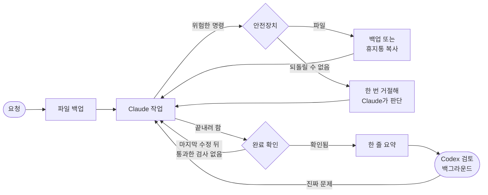

<p align="center">
  
</p>

<p align="center">
  <a href="README.md"><b>English</b></a> · <b>한국어</b>
</p>

<h2 align="center">Claude가 "다 했어요"라고 하면,<br>정말 되는지 vibe-claude가 확인해요.</h2>

<p align="center">
  코드는 읽지 않지만 AI로 무언가를 만드는 사람을 위한 Claude Code 플러그인이에요.<br>
  한 번 설치하면 따로 배울 것은 없어요.
</p>

<table>
<tr>
<td width="50%" valign="top">

### 결과를 확인해요
Claude가 고친 코드를 실행해 보지 않고 끝내려 하면, 돌아가서 시험하게 해요. 정말 통과했는지는 항상 보여드려요.

</td>
<td width="50%" valign="top">

### 파일을 지켜요
요청할 때마다, 그리고 위험한 명령 직전마다 파일을 백업해요. 망가지거나 사라진 게 있으면 "되돌려줘"라고 하면 돼요.

</td>
</tr>
<tr>
<td width="50%" valign="top">

### 다른 AI가 한 번 더 봐요
OpenAI Codex를 쓰고 있다면 변경마다 검토하고, 진짜 문제가 있으면 Claude에게 다시 고치게 해요. Codex가 없으면 이 단계는 건너뛰어요.

</td>
<td width="50%" valign="top">

### 어려운 질문을 하지 않아요
위험한 작업은 사용자에게 묻지 않고 처리해요. 무슨 일이 있었는지는 한 줄로 알려줘요.

</td>
</tr>
</table>

## 설치

Claude Code에 아래 두 줄을 붙여 넣으세요.

```text
/plugin marketplace add kks0488/vibe-claude
/plugin install vibe-claude@vibe-claude
```

Claude Code만 있으면 돼요. Codex는 없어도 괜찮아요.

<p align="center">
  
</p>

## 이렇게 보여요

작업이 끝날 때마다 실제로 무슨 일이 있었는지 한 줄로 알려줘요.

| 표시 | 뜻 |
| --- | --- |
| `vibe ✓ 파일 2개 변경 · 확인됨: npm test` | 마지막으로 고친 뒤에 실제로 시험했고, 통과했어요. |
| `vibe ⚠ … 확인 안 됨` | 시험해 볼 방법이 없었어요. 이 변경은 조심해서 보세요. |
| `vibe ✗ … 검사 실패` | 아직 고장 난 상태이고, Claude도 알고 있어요. |
| `되돌릴 수 없는 작업이 있었어요 — …` | 데이터베이스 초기화처럼 되돌릴 수 없는 일을 했어요. 무엇을 했는지 함께 적혀 있어요. |

되돌리고 싶으면 "되돌려줘" 또는 "로그인 고치기 전으로 돌려줘"라고 하면 돼요.

## 예시

Claude가 다 했다고 하다가 다시 시험하러 돌아가고, 실제로 실행된 내용이 한 줄로 남아요.

<p align="center"></p>

지우기 전에 파일을 보관하고, 되돌릴 수 없는 작업 앞에서는 Claude가 한 번 멈춰 확인하고, "되돌려줘"로 파일을 되찾아요.

<p align="center"></p>

## 검증 방법

- 만든 사람의 실제 작업 기록 16일 치(명령 약 2만 2천 개)로 다듬었어요.
- 자동 테스트 87개와 함께, Claude Code 2.1.286과 Codex CLI 0.162로 직접 돌려 봤어요.
- 공개 전에 Codex에게 네 번 검토받았어요.
- 그 작업 기록 기준으로 AI 사용량은 1% 정도 늘었어요.

---

<details>
<summary><b>기술 정보</b></summary>

### 기능별 동작

| 기능 | 하는 일 |
| --- | --- |
| 완료 확인 | 모든 셸 명령과 실제 종료 코드를 기록해요. 코드를 바꾼 뒤 Claude가 끝내려 할 때, 마지막 수정 이후 통과한 테스트·빌드·실행이 없으면 한 번 돌려보내요. 답변 속 말은 증거가 아니고, 파이프나 `;`, `\|\|`, `&`로 결과가 가려진 것도 인정하지 않아요. 그래도 확인할 수 없으면 끝낼 수는 있지만, 한 줄 요약에 그대로 남아요. |
| 회귀 방지 | 이 프로젝트에서 예전에 통과했던 단순한 검사 명령을 끝날 때 다시 돌려요. 여러 명령을 이은 것이나 배포 명령은 다시 돌리지 않아요. |
| 두 번째 의견 | [Codex CLI](https://github.com/openai/codex)가 설치·로그인돼 있으면, `codex exec`가 변경을 읽기 전용으로 뒤에서 검토하고 진짜 문제가 있으면 `asyncRewake`로 Claude를 다시 깨워요. 요청 하나에 최대 두 번까지예요. |
| 한 줄 요약 | 모델이 쓰는 게 아니라, 기록을 보고 플러그인이 직접 만든 `systemMessage`예요. |
| 백업과 되돌리기 | 요청할 때마다, 위험한 명령 직전마다 프로젝트 밖의 별도 git 저장소에 파일을 저장해요. git을 쓰지 않는 프로젝트도 돼요. `/vibe-claude:undo`로 원하는 시점을 되살리고, 되살린 것도 다시 되돌릴 수 있어요. |
| 휴지통 | 지우기 전에, 백업에 들어가지 않는 파일(git에서 제외된 파일, 5MB 넘는 파일, 프로젝트 밖 파일, 한 번에 300MB까지)을 휴지통에 복사해 7일 동안 보관해요. |
| 안전장치 | 백업으로 되돌릴 수 없는 작업(데이터베이스 초기화, 강제 push, 브랜치·클라우드 삭제)은 이유를 붙여 한 번 거절해서 Claude가 대화를 보고 판단하게 해요. 같은 명령을 다시 실행하면 진행되고, 한 줄 요약에 남아요. 프로젝트·홈 폴더·디스크 전체 삭제는 항상 거절해요. |
| 테스트 보호 | 검사를 지우거나 `skip`·`xfail`·`.only`·항상 참인 검사를 넣는 수정, 커밋된 테스트 삭제는 한 번 거절해요. |
| 패키지 확인 | `npm`, `pnpm`, `yarn`, `bun`, `pip`, `uv`, `poetry`, `cargo` 설치를 공개 저장소와 대조해요. 없는 이름은 거절하고, 생긴 지 14일이 안 된 패키지는 한 번 거절해요. 사내 저장소에는 조회하지 않아요. |
| 비밀키 확인 | 진짜처럼 보이는 API 키나 개인키를 코드에 쓰는 걸 거절해요. `.env`와 키 파일은 괜찮아요. |
| 문법 검사 | Python, JavaScript, TypeScript(프로젝트에 `typescript`가 있을 때), JSON, YAML, TOML, 셸 스크립트, 노트북을 수정할 때마다 검사해요. |

### 필요한 것

Claude Code(2.1.286에서 시험), `python3` 3.8 이상, `git`. Codex CLI는 선택이에요.

### 설정

모두 선택이에요. 프로젝트에 `.vibe/config.json`을 두면 돼요.

```json
{ "codex": "auto", "ratchet": true, "snapshots": true, "packages": true, "lang": null, "safe_to_delete": [] }
```

- `"codex": "off"`로 두 번째 의견을 꺼요.
- `lang`은 `"en"` 또는 `"ko"`예요. 기본값은 쓰는 언어를 따라가요.
- `safe_to_delete`에는 스크린샷이나 빌드 결과처럼 다시 만들어지는 폴더를 적어요. 지울 때 휴지통에 복사하지 않아요.
- `python3 <플러그인 폴더>/hooks/vibe.py status`로 무엇이 켜져 있고 기록이 어디 있는지 볼 수 있어요.

### 업데이트와 끄기

- v5 이상에서 업데이트: `/plugin marketplace update vibe-claude` 다음에 `/plugin update vibe-claude@vibe-claude`
- 끄기: `/plugin disable vibe-claude@vibe-claude`

### Codex에 넘어가는 것

검토할 때 요청 내용과 바뀐 줄을 Codex에 보내요. `.env`, `*.pem`, `*.key` 같은 파일과 개인키가 들어 있는 파일은 빼고, 비밀키처럼 보이는 값은 가린 뒤 보내요. 보내지 않으려면 `"codex": "off"`로 꺼요.

### 기록이 저장되는 곳

프로젝트 밖의 `~/.vibe-claude/`예요. 그래서 `git clean`으로 백업이 지워지지 않고, 내려받은 저장소가 이 기록을 바꿀 수도 없어요. 프로젝트마다 최근 백업 150개를 남기고, 휴지통은 7일 뒤 비워요. 5MB 넘는 파일은 백업하지 않아요. 홈 폴더에서 시작한 작업에는 안전장치만 동작하고, 백업과 완료 확인은 꺼져요.

### 요청이 처리되는 흐름



### 일부러 하지 않는 것

Claude Code에는 이미 계획 모드, 메모리, 서브에이전트, `/rewind`, `/code-review`, `/goal`이 있고, superpowers, spec-kit, claude-mem 같은 프로젝트가 방법론·명세·메모리를 다뤄요. vibe-claude는 그 사이에 비어 있는 것만 더해요. 모델이 꾸밀 수 없는 완료 확인, 같은 모델이 아닌 검토자, 셸 명령으로 바뀐 것까지 되돌리는 기능이에요. 플러그인 전체가 표준 라이브러리만 쓰는 파이썬 파일 하나([`hooks/vibe.py`](hooks/vibe.py))와 스킬 하나예요.

### 자주 묻는 것

**느려지나요?** 시험하지 않은 변경은 한 번 더 시험해요. 백업은 보통 1초도 안 걸리고, 5GB 프로젝트에서는 처음 한 번만 16초 정도 걸렸어요.

**Windows에서 되나요?** 아직 시험하지 않았어요.

**v4의 에이전트 13개는 어디 갔나요?** v5에서 정리했어요. 이야기는 [docs/HISTORY.md](docs/HISTORY.md)에 있어요.

</details>

<p align="center">
  <a href="https://github.com/kks0488/vibe-claude/actions/workflows/ci.yml"></a>
  <a href="https://github.com/kks0488/vibe-claude/releases"></a>
  <a href="LICENSE"></a>
  <br>
  <a href="CHANGELOG.md">변경 기록</a> · <a href="docs/HISTORY.md">개발 이야기</a> · MIT © Kyoungsoo Kim and contributors
</p>
