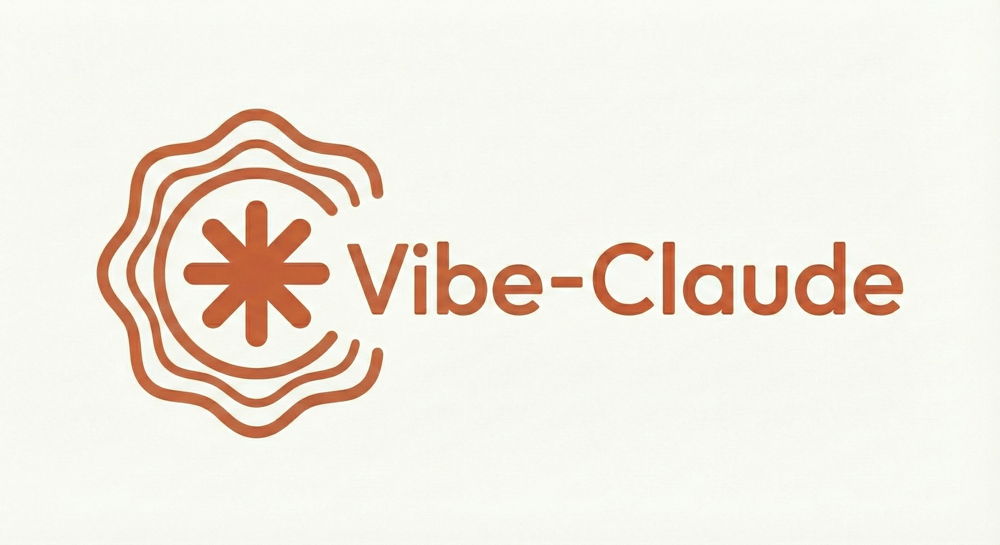

# Vibe-Claude

<p align="center">
  
</p>

> **Don't think. Just vibe. Claude does the rest.**

A **self-evolving** multi-agent orchestration system for Claude Code.
The more you use it, the smarter it gets.

[](https://opensource.org/licenses/MIT)
[](https://claude.ai)

---

## Key Feature: Self-Evolution

**Vibe-Claude evolves itself.** When it encounters a task it can't handle well:

```
Capability gap detected
        ↓
Create new agent prompt or skill
        ↓
Save to ~/.claude/agents/ or ~/.claude/skills/
        ↓
Reference and use in future tasks
```

| Situation | What Happens |
|-----------|--------------|
| Repeated task pattern | Creates reusable prompt template |
| Specialized knowledge needed | Creates expert agent prompt |
| Better method discovered | Updates existing prompts |
| External tool needed | Creates integration skill |

### How Evolution Works

New agents are saved as prompt files. Claude reads and applies them when relevant:

```
User: "Test my API endpoints"
        ↓
Claude checks ~/.claude/agents/
        ↓
Finds v-api-tester.md
        ↓
Reads the prompt and becomes that specialist
```

**The system learns your project's patterns over time.**

---

## Who Is This For?

- "I don't know code" → **You don't need to**
- "Just make it work" → **It will**
- "I hate complexity" → **One command**
- "Money isn't the issue" → **We use Opus liberally**

---

## Quick Start

```bash
# Install (Plugin - Recommended)
claude plugin install vibe-claude

# Or manual install
git clone https://github.com/kks0488/vibe-claude.git ~/.claude-vibe
cp -r ~/.claude-vibe/* ~/.claude/

# Use
/vibe make me a login page
```

That's it. Claude will:
- Analyze what's needed
- Plan the approach
- Build it
- Test it
- Fix any issues
- Repeat until perfect

---

## Usage Examples

```
/vibe create a blog with comments
/vibe fix this authentication bug
/vibe add dark mode to my app
/vibe make this look professional
/vibe refactor the entire API layer
```

Just describe what you want. In any language. However you want.

---

## Philosophy

> **"Vibe coding: where you describe, AI delivers."**

| Traditional Development | Vibe-Claude |
|------------------------|-------------|
| 1. Write requirements | 1. "Make this" |
| 2. Design architecture | 2. Done |
| 3. Write code | |
| 4. Write tests | |
| 5. Debug | |
| 6. Repeat... | |

### Why Does This Work?

**We throw money at it.**

Vibe-Claude uses Opus 4.5 without hesitation:
- Analysis? Opus
- Planning? Opus
- Review? Opus
- Anything complex? Opus

Expensive, but effective.

---

## Architecture

```
┌─────────────────────────────────────────────┐
│              VIBE-CLAUDE                     │
├─────────────────────────────────────────────┤
│                                              │
│  /vibe "your request"                        │
│         ↓                                    │
│  ┌─────────────────────────────────────┐    │
│  │         V-CONDUCTOR                  │    │
│  │    (Auto-routes to right agent)      │    │
│  └─────────────────────────────────────┘    │
│         ↓                                    │
│  ┌─────────────────────────────────────┐    │
│  │           AGENTS (13)                │    │
│  │                                      │    │
│  │  ┌──────────┐ ┌──────────┐          │    │
│  │  │v-analyst │ │v-planner │ ← Opus   │    │
│  │  │v-critic  │ │v-advisor │   (6)    │    │
│  │  │v-conductor│ │v-tester │          │    │
│  │  └──────────┘ └──────────┘          │    │
│  │                                      │    │
│  │  ┌──────────┐ ┌──────────┐          │    │
│  │  │v-worker  │ │v-designer│ ← Sonnet │    │
│  │  │v-researcher│ │v-vision │   (5)    │    │
│  │  │v-api-tester│           │          │    │
│  │  └──────────┘ └──────────┘          │    │
│  │                                      │    │
│  │  ┌──────────┐ ┌──────────┐          │    │
│  │  │v-finder  │ │v-writer  │ ← Haiku  │    │
│  │  └──────────┘ └──────────┘   (2)    │    │
│  └─────────────────────────────────────┘    │
│         ↓                                    │
│  ┌─────────────────────────────────────┐    │
│  │           SKILLS (8)                 │    │
│  │  vibe v-turbo v-git v-style         │    │
│  │  v-evolve v-continue v-memory       │    │
│  │  v-compress                          │    │
│  └─────────────────────────────────────┘    │
│         ↓                                    │
│      RESULT                                  │
│         ↓                                    │
│  Not perfect? → Retry (up to 10x)           │
│         ↓                                    │
│      DONE                                    │
└─────────────────────────────────────────────┘
```

---

## Agents

### Opus Tier (Heavy Lifting)

| Agent | Purpose |
|-------|---------|
| `v-analyst` | Deep debugging, root cause analysis |
| `v-planner` | Strategic planning, architecture design |
| `v-critic` | Ruthless code review, quality gates |
| `v-advisor` | Risk analysis, hidden requirements |
| `v-conductor` | Orchestration, agent routing |
| `v-tester` | Test execution, edge case verification |

### Sonnet Tier (Execution)

| Agent | Purpose |
|-------|---------|
| `v-worker` | Code implementation |
| `v-designer` | UI/UX, styling, components |
| `v-researcher` | Documentation, codebase analysis |
| `v-vision` | Screenshot/image analysis |
| `v-api-tester` | API endpoint testing |

### Haiku Tier (Speed)

| Agent | Purpose |
|-------|---------|
| `v-finder` | Fast file/pattern search |
| `v-writer` | Documentation writing |

---

## Skills (11)

| Skill | Purpose |
|-------|---------|
| `vibe` | Maximum power mode - parallel + retry + verification |
| `v-turbo` | Parallel execution, maximum speed |
| `v-plan` | Strategic planning with v-planner |
| `v-review` | Quality review with v-critic |
| `v-debug` | Systematic debugging with v-analyst |
| `v-git` | Clean commits, git mastery |
| `v-style` | Beautiful UI, design systems |
| `v-evolve` | Self-improvement, creates new capabilities |
| `v-continue` | Session restoration, resume work |
| `v-memory` | AI memory system with auto-recall & auto-save |
| `v-compress` | Context compression, session extension |

---

## How It Works

### Context Management (NEW in v2.1)

> **"Context window is the most valuable resource."**

```
100% ████████████████████ Fresh session
 60% ████████████░░░░░░░░ Caution → /v-compress
 40% ████████░░░░░░░░░░░░ WARNING → checkpoint
 20% ████░░░░░░░░░░░░░░░░ DANGER → /clear
```

**Key Principles:**
- **Subagent-First Exploration**: Delegate exploration to agents, protect main context
- **Two-Strike Rule**: Same failure twice → evaluate context → compress or clear
- **Checkpoint Protocol**: Save progress at phase completion and before risky operations

### Dynamic Routing (NEW in v2.1)

Not all tasks need all phases:

| Complexity | Route | Interview? | Planning? |
|------------|-------|------------|-----------|
| TRIVIAL | P3 only | No | No |
| SIMPLE | P1→P3→P4 | No | No |
| MODERATE | P1→P3→P4 | Optional | No |
| COMPLEX | P0.5→P1→P2→P3→P4→P5 | **YES** | **YES** |

### The 5-Phase System (+ Phase 0.5)

Every task follows this proven structure:

```
┌─────────────────────────────────────────────────┐
│         THE 5-PHASE SYSTEM (+ Phase 0.5)        │
├─────────────────────────────────────────────────┤
│                                                 │
│  Phase 0.5: INTERVIEW (COMPLEX only) ← NEW      │
│  └─ Ask clarifying questions before starting    │
│     - Scope: What's included/excluded?          │
│     - Technical: Patterns, constraints?         │
│     - Edge cases: Error scenarios?              │
│     - Verification: Success criteria?           │
│                                                 │
│  Phase 1: RECON (Parallel)                      │
│  ├─ v-analyst: Analyze requirements             │
│  ├─ v-finder: Find related code                 │
│  ├─ v-researcher: Research best practices       │
│  └─ v-advisor: Identify risks                   │
│                                                 │
│  Phase 2: PLANNING (COMPLEX only)               │
│  └─ v-planner: Create comprehensive plan        │
│                                                 │
│  Phase 3: EXECUTION (Parallel)                  │
│  ├─ v-worker: Implement features                │
│  ├─ v-designer: Build UI components             │
│  └─ v-writer: Write documentation               │
│                                                 │
│  Phase 4: VERIFICATION TRIBUNAL                 │
│  ├─ v-critic: Quality review                    │
│  ├─ v-analyst: Logic verification               │
│  └─ Tests: Automated checks                     │
│  ALL THREE MUST APPROVE                         │
│                                                 │
│  Phase 5: POLISH (COMPLEX only)                 │
│  ├─ Refactor if needed                          │
│  ├─ Add docs/comments                           │
│  └─ Security/performance check                  │
│                                                 │
└─────────────────────────────────────────────────┘
```

### Work Document Tracking

Every `/vibe` task creates a tracking document:
```
.vibe/work-{timestamp}.md
```

This ensures **nothing is forgotten**. Each task is tracked with checkboxes and evidence.

### Evidence-Based Completion

**Nothing is "done" without proof:**
- Code must actually RUN (output shown)
- Tests must actually PASS (results pasted)
- Every feature verified with `file:line` references

**Forbidden phrases:**
- "Should work" → Must TEST it
- "I think it's done" → Must PROVE it
- "Looks correct" → Must RUN it

### Retry Engine (Context-Aware)

```
Attempt 1: Standard approach
    ↓ FAIL
Attempt 2: Alternative method
    ↓ FAIL (Two-Strike → Context Check)

Context > 60%: Continue with v-analyst deep dive
Context 40-60%: /v-compress first, then retry
Context < 40%: /clear + new approach

Attempt 3-10: Various approaches (if context allows)
After 10: Ask user for guidance
```

**Same Error 3x Rule**: Same exact error 3 times? STOP. `/clear` + completely different approach.

### Anti-Patterns (NEW in v2.1)

Vibe-Claude now detects and avoids common failure patterns:

| Pattern | Trigger | Action |
|---------|---------|--------|
| Kitchen Sink | 2+ unrelated tasks | Split sessions |
| Death Spiral | 3+ failed fixes | /clear + root cause |
| Infinite Exploration | 5+ files no plan | Stop + subagent |
| Trust-Verify Gap | Claim without proof | Run verification |
| Subagent Bypass | Direct exploration | Delegate now |

### Batch Operations (NEW in v2.1)

For large-scale changes (5+ files):

```
Orchestrator (main Claude):
├─ Define transformation
├─ List target files
├─ Spawn workers (parallel)
│   ├─ v-worker-1: files 1-5
│   ├─ v-worker-2: files 6-10
│   └─ v-worker-3: files 11-15
├─ Collect results
└─ Verify all succeeded
```

**Writer/Reviewer Pattern**: For quality-critical batch ops, v-worker writes → v-critic reviews → fix issues → final verification.

### Session Management (Enhanced in v2.1)

Never lose progress when context runs out:

| Session Type | Strategy |
|--------------|----------|
| Single-task | Complete → /clear |
| Multi-task | Task → checkpoint → task |
| Exploration | Subagent-heavy, summarize often |
| Long-running | Aggressive checkpointing |

**Checkpoint Protocol:**
```markdown
# .vibe/checkpoint-{timestamp}.md

## Context
- Task: {description}
- Phase: {current phase}
- Progress: {completed items}

## State
- Modified files: {list}
- Pending tasks: {list}

## Resume Instructions
{Exact steps to continue}
```

**Session Handoff:**
1. Create checkpoint
2. `/v-compress` (save details to file)
3. Summary message to user
4. Next session: `/v-continue`

**Command Reference:**

| Command | When to Use | Effect |
|---------|-------------|--------|
| `/clear` | Fresh start needed | Clears all context |
| `/compact` | Context getting full | Summarizes conversation |
| `/v-compress` | Phase complete | Saves details, keeps summary |
| `/v-continue` | Resume previous work | Loads last checkpoint |

No more losing work when sessions end!

---

### Self-Evolution (The Secret Sauce)

This is what makes Vibe-Claude different. When Claude encounters something it can't handle well:

```
Day 1: "I need to optimize database queries"
       → Claude struggles a bit

Day 2: Claude creates v-db-optimizer agent
       → Saves to ~/.claude/agents/v-db-optimizer.md

Day 3+: All DB tasks routed to specialized agent
        → Fast, efficient, tailored to YOUR codebase
```

**Evolution is logged:**
```
~/.claude/evolution-log.md

## [2024-01-15] Created v-db-optimizer

### Reason
Repeated database optimization requests with suboptimal results

### Change
Created specialized agent with PostgreSQL expertise

### Effect
DB optimization tasks now 3x faster with better results
```

The more you use Vibe-Claude, the more it adapts to YOUR specific needs.

---

## Commands

| Command | Description |
|---------|-------------|
| `/vibe <task>` | Maximum power mode - parallel + retry + verification |
| `/v-turbo <task>` | Maximum speed with concurrent execution |
| `/v-plan <task>` | Strategic planning session |
| `/v-review` | Critical evaluation of code/plans |
| `/v-continue` | Resume work from previous session |
| `/v-memory <cmd>` | Save, search, recall knowledge |
| `/v-compress` | Compress context, extend session |
| `/cancel-vibe` | Stop current vibe session |
| `/update` | Check for and install vibe-claude updates |

---

## V-Memory System

AI-powered knowledge system that learns and remembers automatically.

### How It Works

```
┌─────────────────────────────────────────────────┐
│              V-MEMORY SYSTEM                     │
├─────────────────────────────────────────────────┤
│                                                  │
│  AUTO-RECALL (on task start)                     │
│  ├─ /vibe runs → auto-search related memories   │
│  ├─ Error occurs → search similar solutions     │
│  └─ New project → auto-load related knowledge   │
│                                                  │
│  AUTO-SAVE (on task complete)                    │
│  ├─ Failure → Solution → auto-save lesson       │
│  ├─ Same pattern 3x+ → auto-save pattern        │
│  ├─ Tech choice → auto-save decision            │
│  └─ New domain → auto-save context              │
│                                                  │
│  DEDUP (before save)                             │
│  └─ memU check-similar prevents duplicates      │
│                                                  │
└─────────────────────────────────────────────────┘
```

### Memory Types

| Type | Purpose | Auto-Trigger |
|------|---------|--------------|
| `lessons` | Failure → Solution records | 2+ attempts then success |
| `patterns` | Reusable code patterns | Same pattern 3x+ |
| `decisions` | Architecture decisions | Tech choice discussions |
| `context` | Project context | New domain learning |

### Storage

```
~/.claude/.vibe/memory/
├── lessons/      # Failure → Solution
├── patterns/     # Code patterns
├── decisions/    # Architecture decisions
└── context/      # Project knowledge
```

### memU Integration (Optional)

**Works without memU** - local file storage + grep search.

With memU enabled:
- **Semantic search**: Search by meaning, not keywords
- **Deduplication**: 85%+ similarity check prevents duplicates
- **Auto-sync**: Local saves sync to memU automatically

**The more you use it, the smarter it gets.**

---

## File Structure (Plugin)

```
vibe-claude/
├── .claude-plugin/    # Plugin metadata
│   ├── plugin.json
│   └── marketplace.json
├── agents/            # 13 specialized agents
│   ├── v-analyst.md
│   ├── v-worker.md
│   ├── v-designer.md
│   └── ...
├── skills/            # 11 enhancement skills
│   ├── vibe/
│   ├── v-turbo/
│   ├── v-plan/
│   ├── v-review/
│   ├── v-debug/
│   └── ...
├── commands/          # Slash commands
│   ├── v-plan.md
│   ├── v-review.md
│   └── v-debug.md
├── hooks/             # Auto-execution hooks
│   ├── hooks.json
│   └── session-start.sh
├── scripts/           # Helper scripts
│   ├── v-memory.sh
│   ├── v-compress.sh
│   └── v-continue.sh
├── assets/            # Images
├── CLAUDE.md          # Plugin instructions
└── README.md          # This file
```

### Update Plugin

```bash
claude plugin update vibe-claude
```

---

## FAQ

**Q: Do I need to know how to code?**
A: No.

**Q: What do I need to do?**
A: Type `/vibe` and describe what you want.

**Q: What if it doesn't work?**
A: Claude retries automatically. Until it works.

**Q: Is it expensive?**
A: Yes. But it works.

**Q: Can I customize the agents?**
A: Yes. Edit the markdown files in `~/.claude/agents/`.

---

## The Vibe Coder Manifesto

1. **Don't think, describe** - Say what you want, not how
2. **Trust the process** - Let Claude figure it out
3. **Money solves problems** - Opus is worth it
4. **Perfection is automatic** - Retries until right
5. **Evolution is constant** - System improves itself every day

---

## Contributing

Pull requests welcome. Keep it simple. Keep it vibe.

---

## Inspired By

This project draws inspiration from:

- [opencode](https://github.com/anomalyco/opencode) - Open-source AI coding assistant
- [Claude Code Documentation](https://docs.anthropic.com/en/docs/claude-code) - Official Anthropic documentation for Claude Code
- [Claude Agent SDK](https://github.com/anthropics/anthropic-sdk-python) - Multi-agent patterns and best practices
- The open-source AI coding community

---

## License

MIT

---

## Author

Created with vibes by [@kks0488](https://github.com/kks0488)

---

**Don't think. Just vibe. Claude does the rest.**
