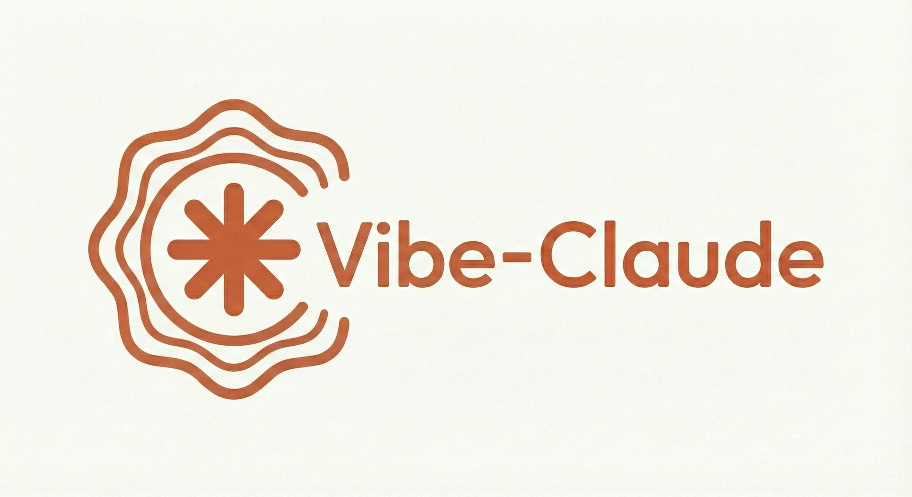

# Vibe-Claude

<p align="center">
  
</p>

> Don't fight the tool. Sharpen the edge.

A minimal, open-source guardrail plugin for [Claude Code](https://code.claude.com/docs) — distilled through several months of real use down to what repeatedly helped.

[](https://opensource.org/licenses/MIT)
[](https://claude.ai)
[](https://github.com/kks0488/vibe-claude/actions/workflows/ci.yml)

---

## What This Is

2 hooks. 5 rules. That's the core.

Vibe-Claude adds two things Claude Code doesn't enforce natively:

1. **Stop Guard** — Challenges completion claims that do not include execution evidence
2. **Post-Edit Check** — Validates syntax after every file edit

Everything else is Claude Code doing what it already does best.

---

## Install

In Claude Code:

```text
/plugin marketplace add kks0488/vibe-claude
/plugin install vibe-claude@vibe-claude
```

The plugin supplies the hooks without changing your selected model. `CLAUDE.md` is an optional project-instruction template; copy or adapt it only if its five rules fit your project.

For local development, clone the repository and run `claude --plugin-dir ./vibe-claude`.

## Structure

```
vibe-claude/
├── .claude-plugin/     # plugin and marketplace manifests
├── hooks/
│   ├── hooks.json      # hook registry
│   ├── stop-guard.sh   # completion claim → evidence check
│   └── post-edit.sh    # lightweight syntax checks
├── tests/              # hook regression tests
└── CLAUDE.md           # optional 5-rule template
```

---

## The Rules

From `CLAUDE.md`:

1. **Prove it, don't claim it** — Show execution output before claiming done. "Should work" is banned.
2. **Delegate exploration** — Use subagents for searching/reading. Keep main context for decisions.
3. **Two-Strike Rule** — Same error twice → change the approach entirely.
4. **Clarify material ambiguity** — Ask only when an unresolved choice would materially change the result.
5. **Minimal changes** — Only change what was asked. No drive-by refactors.

## The Hooks

| Hook | Trigger | What it does |
|------|---------|-------------|
| stop-guard | Agent tries to stop | For completion claims, blocks once unless test/build/lint/typecheck/execution evidence is present |
| post-edit | After Write/Edit | Runs syntax validation (Python, JS, JSON, YAML, Bash) |

---

## v5.1: Updated After Months of Use

The March 2026 v5 release was intentionally small. Continued use exposed a second class of problems: the old hooks depended on stale input fields, could loop after blocking, accepted source references as proof, interpolated filenames into executable snippets, and forced the `opus` model globally.

The August 2026 v5.1 update fixes those operational problems, adds regression tests and CI, and packages the project as a native Claude Code plugin. The detailed findings are in [`docs/RESEARCH_2026-08.md`](docs/RESEARCH_2026-08.md), and release-level changes are in [`CHANGELOG.md`](CHANGELOG.md).

## The Story: Why v5 Exists

### What we built (v1 — v4)

Over 4 major versions, Vibe-Claude grew into a full orchestration system:

- **13 specialized agents** — analyst, planner, critic, worker, designer, conductor, tester, researcher, advisor, finder, vision, api-tester, writer
- **8 skills** — vibe, v-turbo, v-git, v-style, v-evolve, v-continue, v-memory, v-compress
- **5-Phase pipeline** — Routing → Interview → Recon → Planning → Execution → Verification → Polish
- **8 hook events** — Setup, SessionStart, UserPromptSubmit, SubagentStart, TeammateIdle, TaskCompleted, Stop, PostToolUse
- **Self-evolution system** — automatic agent creation when capability gaps were detected
- **Memory system** — lessons, patterns, decisions, context with grep-based recall
- **Context management** — compression, checkpointing, session handoff

689 lines of markdown prompts orchestrating Claude Code like a puppet theater.

### What happened

**Claude Code's updates outpaced our development.**

Every few weeks, Anthropic shipped features that made our layers redundant:

| What we built | What Claude Code shipped |
|--------------|------------------------|
| v-memory (file + grep) | Auto Memory (built-in, semantic) |
| v-compress (context compression) | Compaction API (server-side, automatic) |
| v-continue (session restore) | Session auto-restore (built-in) |
| v-conductor (orchestrator agent) | Agent tool + subagents (built-in) |
| v-turbo (parallel execution) | Parallel tool calls (built-in) |
| v-finder (file search) | Glob, Grep, Explore agent (built-in) |
| 13 persona agents | Claude already plays every role |
| 5-Phase system | Plan mode (built-in) |

We were writing prompt instructions for things Claude already knew how to do. The 13 agents were personality wrappers. The 5-Phase system was a rigid pipeline over Claude's natural reasoning. The skills were markdown files restating built-in capabilities.

**The system wasn't enhancing Claude Code. It was constraining it.**

All that markdown was consuming context window — the most precious resource — to tell Claude things it already knew.

### What we kept

We asked: *"What does Claude Code still not do well?"*

Two things:

1. **It sometimes claims "done" without actually running the code.** The stop-guard hook fixes this at the process level — not a prompt suggestion, an actual gate.

2. **It sometimes breaks syntax after edits.** The post-edit hook catches this immediately — automatic validation, zero context cost.

Everything else was deleted. 93% reduction.

### The result

| | v4 | v5 |
|-|----|----|
| Files | 70+ | 5 |
| Agents | 13 | 0 |
| Skills | 8 | 0 |
| Hooks | 8 | 2 |
| Lines of prompts | ~689 | ~20 |
| Context overhead | High | Near zero |

---

## Lessons Learned

For anyone building systems on top of AI coding tools — we learned these the hard way.

### 1. The platform will eat your features.

We spent weeks building a memory system with file-based storage and grep search. Then Claude Code shipped Auto Memory with semantic recall. We built a context compression skill. Then Compaction API landed, server-side and automatic. We built a session restore command. It became a built-in.

**Every feature we built was a bet that the platform wouldn't solve it natively. We lost every bet.**

If you're building on top of an AI tool that ships updates every few weeks, ask yourself: "Will this still be needed in 3 months?" If you're not sure, don't build it. Wait. The platform is probably already working on it.

### 2. Prompts are not code.

We wrote 689 lines of markdown telling Claude how to behave. "NEVER stop without proof." "ALWAYS delegate exploration." "Run verification tribunal."

Here's the uncomfortable truth: **a prompt is a suggestion, not a contract.** Claude can ignore every word. And sometimes it did.

The only things that actually worked were the hooks — real code running at the process level, returning exit codes that the system respects. The stop-guard hook doesn't ask Claude to show evidence. It checks for evidence and blocks the stop if it's not there.

**If you need a guarantee, write code. If you need a suggestion, write a prompt. Know which one you need.**

### 3. Complexity has a hidden cost: context.

Our 13 agents, 8 skills, and 5-Phase system looked impressive. But every one of those markdown files gets loaded into the context window. That's thousands of tokens spent before Claude writes a single line of code.

Context window is Claude's working memory. Every token of system prompt is a token that can't be used for reasoning about your actual problem. We were filling Claude's brain with instructions about how to think, leaving less room for actual thinking.

**The irony: our "enhancement" was making Claude dumber by stealing its context.**

After removing 93% of the prompts, Claude performed better on the same tasks. Not because we added something. Because we removed what was in the way.

### 4. Persona prompts are an illusion.

We had 13 agents: v-analyst, v-planner, v-critic, v-worker, v-designer... Each with a personality, a role description, permission settings.

But Claude doesn't become a better analyst because you tell it "you are an analyst." It's already trained on analysis. The persona file was a costume, not a capability. Claude in a v-analyst costume is the same Claude without it — except now it's spending tokens reading the costume description.

**Don't tell the model what it already knows. Don't wrap capabilities in personas. Just ask for what you need.**

### 5. The hardest skill is deletion.

v1 took a week. v2 added agents. v3 added skills. v4 added hooks, teams, frontmatter, evolution. Each version was bigger, more complex, more "powerful."

v5 deleted 93% of it.

That deletion was harder than any of the building. Every file we removed was something we'd designed, tested, debugged, documented. Deleting it felt like admitting failure.

But it wasn't failure. The system worked — it worked so well that the platform adopted the same ideas. Our job was done. We just needed to accept that.

**If your enhancement layer keeps growing, you're probably solving problems the platform will solve better. Stop. Measure what actually helps. Delete the rest.**

### 6. Find the real gaps.

After deleting everything, we asked: "What does Claude Code actually fail at?"

Not "what could be theoretically better" — what actually goes wrong in practice?

Two things: (1) It sometimes says "done" without running the code. (2) It sometimes breaks syntax. That's it. Two problems. Two hooks. Done.

**Don't build for imagined weaknesses. Watch the tool fail in practice. Fix those specific failures. Nothing more.**

---

## FAQ

**Q: Won't removing all the agents make it weaker?**

No. Claude Code spawns subagents on its own when needed. A markdown file saying "you are an analyst" doesn't make Claude a better analyst — it just uses context.

**Q: What about complex multi-step tasks?**

Use Claude Code's built-in Plan mode (`/plan`). It's more flexible than a rigid 5-Phase pipeline and doesn't cost context.

**Q: What about memory?**

Claude Code's Auto Memory handles this natively. It's better than our grep-based system.

**Q: Should I upgrade from v4 or v5.0?**

Yes. Move from v4 to the small v5 design. v5.0 users should update because v5.1 follows the current hook schema, prevents continuation loops, fixes unsafe path interpolation, and no longer overrides model choice.

---

## License

[MIT](LICENSE) © Kyoungsoo Kim and contributors.

## Author

Created by [@kks0488](https://github.com/kks0488)

---

> *The best system is the one you don't notice.*
