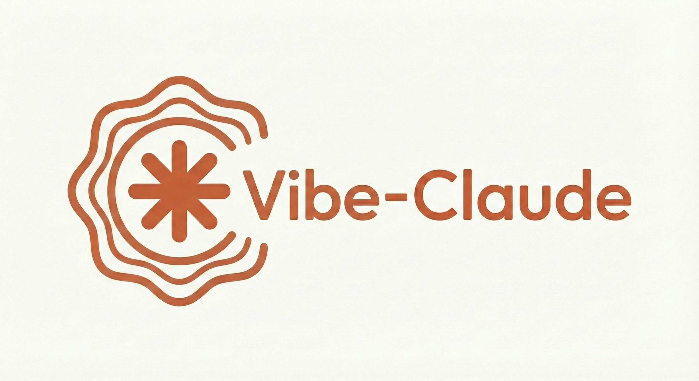

# Vibe-Claude

<p align="center">
  
</p>

> For people who build with Claude Code but don't read the code.

[](https://opensource.org/licenses/MIT)
[](https://github.com/kks0488/vibe-claude/actions/workflows/ci.yml)

If you can't read code, you can't tell when the AI says "done" but nothing works, when a fix quietly broke something else, or when a command is about to delete your files. Vibe-Claude adds checks that run as code, not as prompt advice, so the model can't talk its way past them.

## What it does

| | When | What happens |
|-|------|--------------|
| **Proof** | Claude tries to finish after changing code | A log records every command and its real exit code. Claude can't finish until a test, build or run of the program passes **after the last edit**. Writing "tests passed" doesn't count. Neither does piping into `tail` or adding `\|\| true`, since both hide failures. |
| **Regression ratchet** | Same | Checks that passed before in this project run again. If one breaks, Claude has to fix it before finishing. |
| **Second opinion** | After a verified change, if [Codex CLI](https://github.com/openai/codex) is installed and logged in | A different model (OpenAI Codex) reviews the change in the background, read-only. If it finds a real problem, Claude is woken up to check and fix it. Without Codex this step is skipped. |
| **Receipt** | Every finished change | One line only you see, written from the log, not by the model: `vibe ✓ 2 files changed · checked: npm test · undo: /vibe-claude:undo` |
| **Guard** | Before a risky command | **You are never asked**: you can't judge code, so questions would only get clicked through. A backup is taken first; files the backup misses (git-ignored, large, outside the project, up to 300 MB) are copied to a 7-day trash, then the command runs. Steps no backup can undo (force push, `DROP TABLE`, database resets, cloud deletes) stop Claude once so it checks whether you really asked for that; if so it repeats the command, and the receipt tells you it happened. Wiping your home folder or the whole disk is always refused. |
| **Test guard** | Before a test file is edited | Removing checks, adding `skip`, or adding always-true checks stops Claude once and tells it to fix the code instead. This is how AI "passes" tests without fixing anything. |
| **Package check** | Before `npm`/`pip`/`cargo` installs | Packages that don't exist are blocked (AI often invents names, and attackers register them). Packages less than 14 days old stop Claude once to double-check. |
| **Secret check** | Before a file is written | Real-looking API keys going into code are blocked. `.env` files are allowed. |
| **Undo** | At every request and before every risky command | Your files are snapshotted into a private git store in `~/.vibe-claude/`, outside the project, so even `git clean` can't delete the backups, and it works whether or not the project uses git. Say `/vibe-claude:undo` (or "go back to before the login change") to restore. Ignored files, files over 5 MB, databases and online services are not included, and the confirmation question says so when that matters. |
| **Syntax check** | After every edit | Python, JS, TS (when the project has TypeScript), JSON, YAML, TOML, shell, notebooks. |

When nothing is wrong you see nothing except the receipt. Claude gets five short rules at session start, and longer messages only when something is blocked.

## Install

In Claude Code:

```text
/plugin marketplace add kks0488/vibe-claude
/plugin install vibe-claude@vibe-claude
```

Requires `python3` and `git`. Optional: `codex` (run `codex login` once) for the second opinion.

For local development: `claude --plugin-dir ./vibe-claude`.

## Settings

Optional `.vibe/config.json` in your project (or `config.json` in the project's folder under `~/.vibe-claude/projects/`):

```json
{ "codex": "auto", "ratchet": true, "snapshots": true, "packages": true, "lang": null, "safe_to_delete": [] }
```

`"codex": "off"` turns off the second opinion. `lang` is `"en"` or `"ko"`; by default it follows the language you write in.

`python3 <plugin>/hooks/vibe.py status` shows what is active and where the state is kept, and `vibe.py checks` lists the checks the ratchet remembers (`checks forget "<cmd>"` removes one).

## What it deliberately doesn't do

Claude Code already has plan mode, memory, subagents, `/rewind`, `/code-review` and `/goal`, and projects like superpowers, spec-kit and claude-mem cover methodology, specs and memory. Vibe-Claude only covers what those leave open: proof that a model can't fake, a reviewer that isn't the same model, and an undo that also covers changes made by shell commands. The whole plugin is one standard-library Python file, [`hooks/vibe.py`](hooks/vibe.py), and one skill.

How it got here, from a 13-agent framework to this: [docs/HISTORY.md](docs/HISTORY.md).

## 한국어 요약

코드를 읽지 못해도 Claude Code로 만들 수 있게 돕는 안전장치예요.

- **증명**: Claude가 코드를 고친 뒤에는, 마지막 수정 이후 테스트나 실행이 실제로 통과해야 끝낼 수 있어요. "다 됐어요"라는 말만으로는 끝낼 수 없어요.
- **두 번째 의견**: Codex가 설치돼 있으면 다른 모델이 변경을 검토하고, 문제가 있으면 Claude가 다시 고쳐요.
- **영수증**: 끝날 때마다 무엇이 바뀌었고 무엇으로 확인했는지 한 줄로 보여 줘요.
- **질문 없음**: 사용자에게는 아무것도 묻지 않아요. 지우기 전에 백업하고, 백업에 없는 파일은 휴지통(7일 보관)에 복사한 뒤 진행해요. 데이터베이스 초기화처럼 되돌릴 수 없는 작업은 Claude가 한 번 더 생각하게 하고, 했다면 영수증으로 알려줘요.
- **되돌리기**: 요청할 때마다 파일을 자동으로 백업해요. `/vibe-claude:undo`로 이전 상태로 돌아갈 수 있어요.

## License

[MIT](LICENSE) © Kyoungsoo Kim and contributors.
