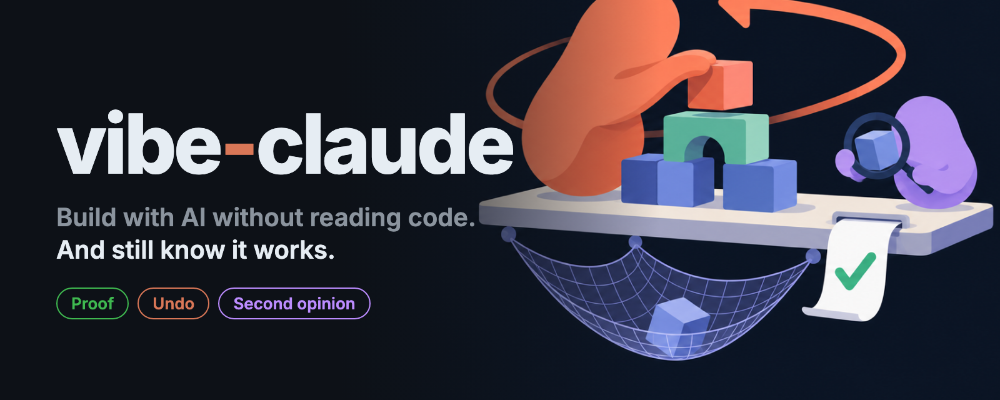

<p align="center">
  
</p>

<p align="center">
  <b>English</b> · <a href="README.ko.md"><b>한국어</b></a>
</p>

<h2 align="center">When Claude says it's done,<br>vibe-claude checks that it actually works.</h2>

<p align="center">
  For people who build with Claude Code but don't read code.<br>
  Install it once. There is nothing to learn.
</p>

<table>
<tr>
<td width="50%" valign="top">

### It checks the work
Claude can't finish a change until the code was actually run and passed. Saying "it works" doesn't count.

</td>
<td width="50%" valign="top">

### It keeps your files safe
Every change is backed up. If something breaks or gets deleted, say "undo".

</td>
</tr>
<tr>
<td width="50%" valign="top">

### A second AI reviews the change
If you use OpenAI Codex, it reviews each change and sends Claude back to fix real problems. Without Codex this step is skipped.

</td>
<td width="50%" valign="top">

### It doesn't ask you technical questions
Risky steps are handled without asking you, and you get a one-line summary of what happened.

</td>
</tr>
</table>

## Install

Paste these two lines into Claude Code:

```text
/plugin marketplace add kks0488/vibe-claude
/plugin install vibe-claude@vibe-claude
```

Only Claude Code is required. Codex is optional.

<p align="center">
  
</p>

## What you'll see

Each change ends with one line that says what really happened:

| Line | Meaning |
| --- | --- |
| `vibe ✓ 2 files changed · checked: npm test` | It was tested after the last change and passed. |
| `vibe ⚠ … NOT verified` | Nothing could be tested. Treat this change with care. |
| `vibe ✗ … check FAILED` | It is still broken, and Claude has been told. |
| `… could not be undone — …` | Claude did something permanent, such as resetting a database. The line says what. |

To go back, say "undo" or "go back to before the login change".

## Examples

Claude says it's done, gets stopped, runs the tests, and the summary line shows what ran:

<p align="center"></p>

Files are kept before a delete, a permanent step makes Claude stop and check, and "undo" restores the files:

<p align="center"></p>

## Testing

- Tuned against 16 days of real sessions, about 22,000 commands.
- 87 automated tests, plus end-to-end runs with Claude Code and Codex.
- Reviewed four times by Codex before release.
- Adds about 1% to AI usage.

---

<details>
<summary><b>Technical details</b></summary>

<br>

| Part | What happens |
| --- | --- |
| **Proof gate** | Every shell command and its real exit code is logged. After a code change, Claude can't stop until a test, build or run of the program passes *after the last edit*. Words in the reply don't count; neither does a result hidden by a pipe, `;` or `\|\| true`. |
| **Regression ratchet** | Single check commands that passed before in the project are re-run at the end of a change. |
| **Second opinion** | With [Codex CLI](https://github.com/openai/codex) installed and logged in, `codex exec` reviews the diff read-only in the background (secrets redacted) and wakes Claude via `asyncRewake` on findings. |
| **Summary line** | A `systemMessage` built from the log, never from the model. |
| **Snapshots + undo** | A private git store in `~/.vibe-claude/` (outside the project) saves your files at every request and before risky commands, git project or not. `/vibe-claude:undo` restores by snapshot id and can itself be undone. |
| **Trash** | Files a delete would remove that snapshots don't cover (git-ignored, over 5 MB, outside the project; up to 300 MB) are copied to a 7-day trash first. |
| **Guard** | Irreversible steps (database resets, force pushes, cloud deletes, branch deletes) are denied once with a reason so Claude decides from the conversation; the identical retry goes through and the receipt reports it. Deleting the project, home folder or disk is always refused. |
| **Test guard** | Edits that remove assertions, add `skip`/`xfail`/`.only` or always-true checks, and deletions of committed tests, are stopped once. |
| **Package check** | `npm`/`pip`/`uv`/`cargo` installs are checked against the public registry: names that don't exist are refused, packages under 14 days old are stopped once. Private registries are never queried. |
| **Secret check** | Writing real-looking API keys or private keys into code is refused; `.env` files are allowed. |
| **Syntax check** | Python, JS, TS (with the project's own `typescript`), JSON, YAML, TOML, shell and notebooks. |

**Requirements:** `python3` and `git`. Codex is optional.

**Settings:** optional `.vibe/config.json` in your project:

```json
{ "codex": "auto", "ratchet": true, "snapshots": true, "packages": true, "lang": null, "safe_to_delete": [] }
```

`"codex": "off"` turns the second opinion off. `lang` is `"en"` or `"ko"` (default: the language you write in). `python3 <plugin>/hooks/vibe.py status` shows what is active.

**How a request flows:**


```mermaid
flowchart LR
    A([You ask]) --> B[Snapshot<br/>your files]
    B --> C[Claude works]
    C -->|risky command| G{Guard}
    G -->|files| T[Back up or<br/>copy to trash] --> C
    G -->|irreversible| S[Stop Claude once<br/>to decide] --> C
    C -->|wants to stop| P{Proof gate}
    P -->|no passing check<br/>after last edit| C
    P -->|verified| R[Receipt] --> X([Codex review<br/>in background])
    X -->|real problem| C
```

**What it deliberately doesn't do:** Claude Code already has plan mode, memory, subagents, `/rewind`, `/code-review` and `/goal`; superpowers, spec-kit and claude-mem cover methodology, specs and memory. vibe-claude only adds what those leave open: proof a model can't fake, a reviewer that isn't the same model, and an undo that also covers shell commands. The whole plugin is one standard-library Python file, [`hooks/vibe.py`](hooks/vibe.py), and one skill.

**FAQ.** *Slower?* An unchecked change gets one extra round of testing; snapshots take under a second on typical projects. *Need Codex?* No; the review step is skipped without it. *Windows?* Not tested yet. *Where did the 13 agents go?* See [docs/HISTORY.md](docs/HISTORY.md).

</details>

<p align="center">
  <a href="https://github.com/kks0488/vibe-claude/actions/workflows/ci.yml"></a>
  <a href="https://github.com/kks0488/vibe-claude/releases"></a>
  <a href="LICENSE"></a>
  <br>
  <a href="CHANGELOG.md">Changelog</a> · <a href="docs/HISTORY.md">History</a> · MIT © Kyoungsoo Kim and contributors
</p>
