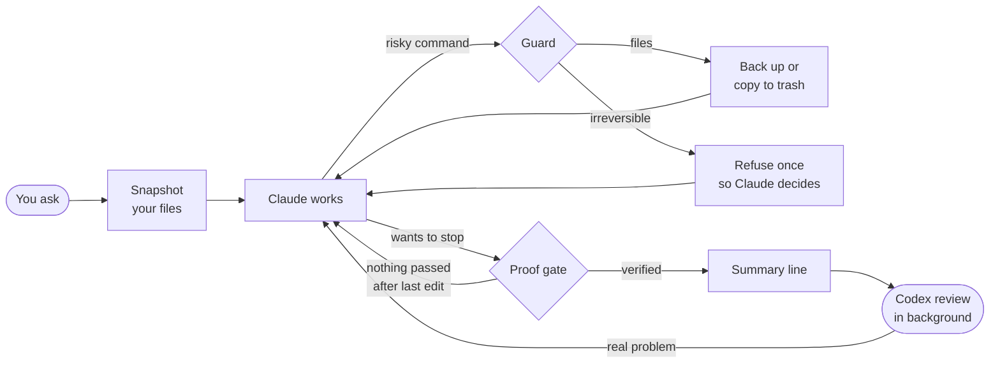

<p align="center">
  
</p>

<p align="center">
  <b>English</b> · <a href="README.ko.md"><b>한국어</b></a>
</p>

<h2 align="center">When Claude says it's done,<br>vibe-claude checks that it actually works.</h2>

<p align="center">
  A Claude Code plugin for people who build with AI but don't read code.<br>
  Install it once. There is nothing to learn.
</p>

<table>
<tr>
<td width="50%" valign="top">

### It checks the work
If Claude tries to finish without running the code it changed, it is sent back to test it. You always see whether it really passed.

</td>
<td width="50%" valign="top">

### It keeps your files safe
Your files are backed up before every request and before risky commands. If something breaks or disappears, say "undo".

</td>
</tr>
<tr>
<td width="50%" valign="top">

### A second AI reviews the change
If you use OpenAI Codex, it reviews each change and sends Claude back to fix real problems. Without Codex this step is skipped.

</td>
<td width="50%" valign="top">

### It doesn't ask you technical questions
Risky steps are handled without asking you. A one-line summary tells you what happened.

</td>
</tr>
</table>

## Install

Paste these two lines into Claude Code:

```text
/plugin marketplace add kks0488/vibe-claude
/plugin install vibe-claude@vibe-claude
```

Only Claude Code is required. Codex is optional.

<p align="center">
  
</p>

## What you'll see

Each change ends with one line that says what really happened:

| Line | Meaning |
| --- | --- |
| `vibe ✓ 2 files changed · checked: npm test` | It was tested after the last change and passed. |
| `vibe ⚠ … NOT verified` | Nothing could be tested. Treat this change with care. |
| `vibe ✗ … check FAILED` | It is still broken, and Claude has been told. |
| `… could not be undone — …` | Claude did something permanent, such as resetting a database. The line says what. |

To go back, say "undo" or "go back to before the login change".

## Examples

Claude says it's done, is sent back, runs the tests, and the summary line shows what ran:

<p align="center"></p>

Files are kept before a delete, a permanent step makes Claude stop and check, and "undo" restores the files:

<p align="center"></p>

## How it was tested

- Tuned against 16 days of the author's real sessions, about 22,000 commands.
- 87 automated tests, plus end-to-end runs with Claude Code 2.1.286 and Codex CLI 0.162.
- Reviewed four times by Codex before release.
- In those sessions it added about 1% to AI usage.

---

<details>
<summary><b>Technical details</b></summary>

### What each part does

| Part | What happens |
| --- | --- |
| Proof gate | Every shell command and its real exit code is logged. When Claude tries to stop after changing code, it is sent back once unless a test, build or run of the program passed after the last edit. Words in the reply don't count, and neither does a result hidden by a pipe, `;`, `\|\|` or `&`. If it still can't verify, it may stop, and the summary line says so. |
| Regression ratchet | Plain check commands that passed before in the project (never compound commands or deploys) are re-run at the end of a change. |
| Second opinion | With [Codex CLI](https://github.com/openai/codex) installed and logged in, `codex exec` reviews the change read-only in the background and wakes Claude through `asyncRewake` if it finds a real problem. At most two rounds per request. |
| Summary line | A `systemMessage` built from the log, never written by the model. |
| Snapshots and undo | A private git store outside the project saves your files at every request and before risky commands, whether or not the project uses git. `/vibe-claude:undo` restores a chosen snapshot, and the restore can itself be undone. |
| Trash | Before a delete, files the snapshots don't cover (git-ignored, over 5 MB, or outside the project; up to 300 MB per delete) are copied to a trash kept for 7 days. |
| Guard | Steps no backup can undo (database resets, force pushes, branch and cloud deletes) are refused once with a reason, so Claude decides from the conversation; the identical retry goes through and the summary line reports it. Deleting the project, your home folder or a disk is always refused. |
| Test guard | Removing assertions, adding `skip`/`xfail`/`.only` or always-true checks, and deleting committed tests are refused once. |
| Package check | `npm`, `pnpm`, `yarn`, `bun`, `pip`, `uv`, `poetry` and `cargo` installs are checked against the public registry. Names that don't exist are refused; packages under 14 days old are refused once. Private registries are never queried. |
| Secret check | Writing real-looking API keys or private keys into code is refused. `.env` and key files are allowed. |
| Syntax check | Python, JavaScript, TypeScript (when the project has `typescript`), JSON, YAML, TOML, shell scripts and notebooks, after every edit. |

### Requirements

Claude Code (tested with 2.1.286), `python3` 3.8 or later, and `git`. Codex CLI is optional.

### Settings

All optional. Put a `.vibe/config.json` in your project:

```json
{ "codex": "auto", "ratchet": true, "snapshots": true, "packages": true, "lang": null, "safe_to_delete": [] }
```

- `"codex": "off"` turns the second opinion off.
- `lang` is `"en"` or `"ko"`. By default it follows the language you write in.
- `safe_to_delete` lists folders of generated files (screenshots, build output) that don't need a trash copy.
- `python3 <plugin folder>/hooks/vibe.py status` shows what is active and where its data is kept.

### Updating and turning it off

- Update from v5 or later: `/plugin marketplace update vibe-claude`, then `/plugin update vibe-claude@vibe-claude`.
- Turn it off: `/plugin disable vibe-claude@vibe-claude`.

### What Codex sees

The review sends Codex the request and the changed lines. Files named like `.env`, `*.pem` or `*.key`, files containing private keys, and secret-looking values are left out or masked first. Turn the review off with `"codex": "off"`.

### Where data is kept

In `~/.vibe-claude/`, outside your projects, so `git clean` can't delete the backups and a cloned repository can't change them. The newest 150 snapshots per project are kept; the trash is emptied after 7 days. Files over 5 MB are not snapshotted. Sessions started in your home folder get the guard but no snapshots or proof gate.

### How a request flows


```mermaid
flowchart LR
    A([You ask]) --> B[Snapshot<br/>your files]
    B --> C[Claude works]
    C -->|risky command| G{Guard}
    G -->|files| T[Back up or<br/>copy to trash] --> C
    G -->|irreversible| S[Refuse once<br/>so Claude decides] --> C
    C -->|wants to stop| P{Proof gate}
    P -->|nothing passed<br/>after last edit| C
    P -->|verified| R[Summary line] --> X([Codex review<br/>in background])
    X -->|real problem| C
```

### What it deliberately doesn't do

Claude Code already has plan mode, memory, subagents, `/rewind`, `/code-review` and `/goal`, and projects like superpowers, spec-kit and claude-mem cover methodology, specs and memory. vibe-claude only adds what those leave open: proof the model can't fake, a reviewer that isn't the same model, and an undo that also covers changes made by shell commands. The whole plugin is one standard-library Python file, [`hooks/vibe.py`](hooks/vibe.py), and one skill.

### FAQ

**Does it slow things down?** A change that was never tested gets one extra round of testing. Snapshots take under a second on typical projects, and about 16 seconds the first time on a 5 GB project.

**Windows?** Not tested yet.

**Where did the 13 agents from v4 go?** Removed in v5. The story is in [docs/HISTORY.md](docs/HISTORY.md).

</details>

<p align="center">
  <a href="https://github.com/kks0488/vibe-claude/actions/workflows/ci.yml"></a>
  <a href="https://github.com/kks0488/vibe-claude/releases"></a>
  <a href="LICENSE"></a>
  <br>
  <a href="CHANGELOG.md">Changelog</a> · <a href="docs/HISTORY.md">History</a> · MIT © Kyoungsoo Kim and contributors
</p>
